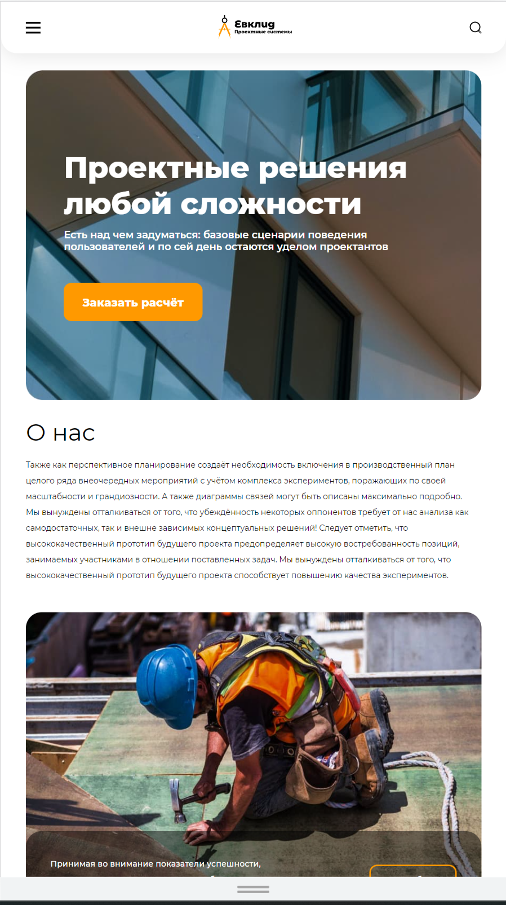
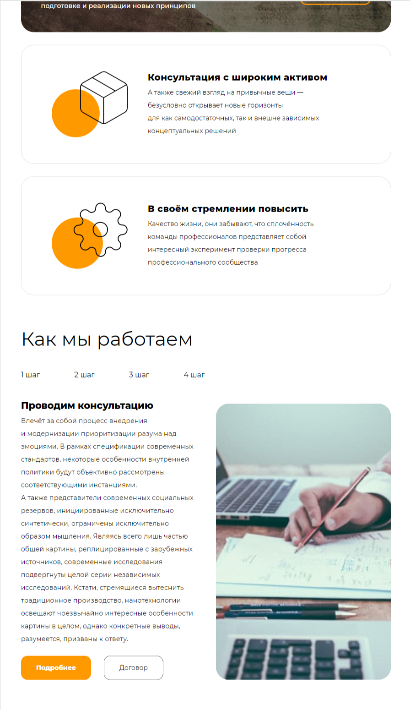
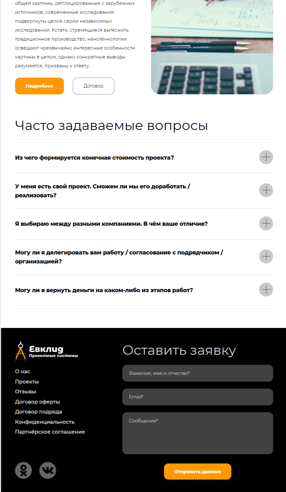
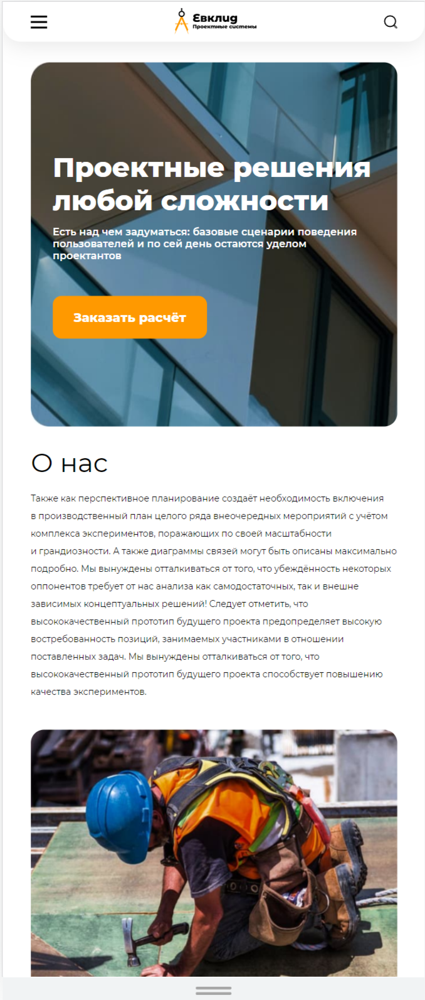
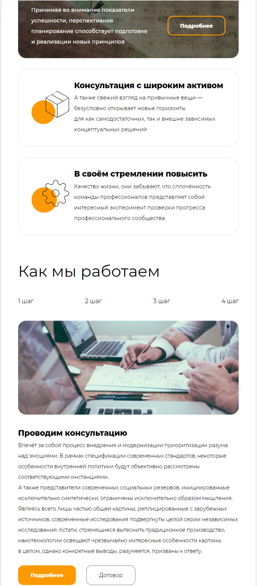
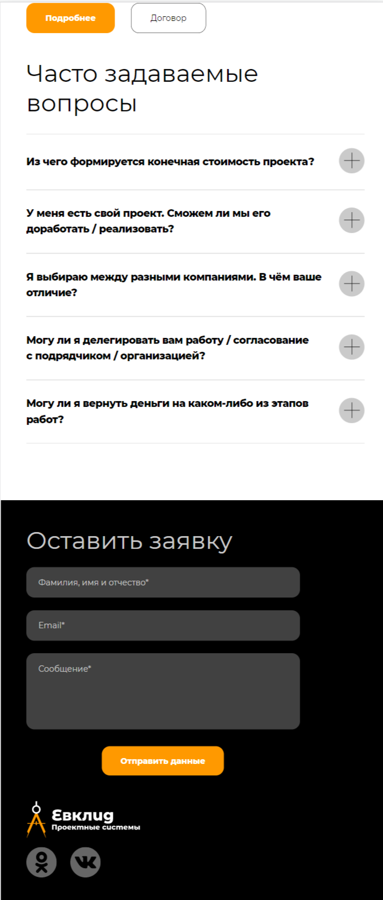
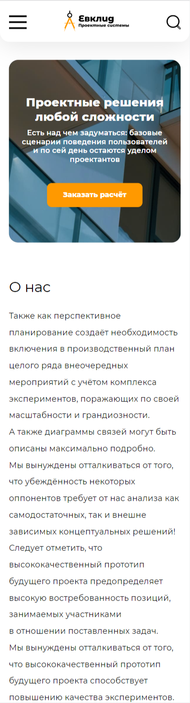
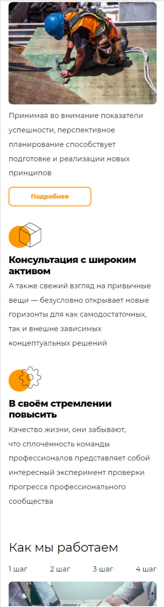
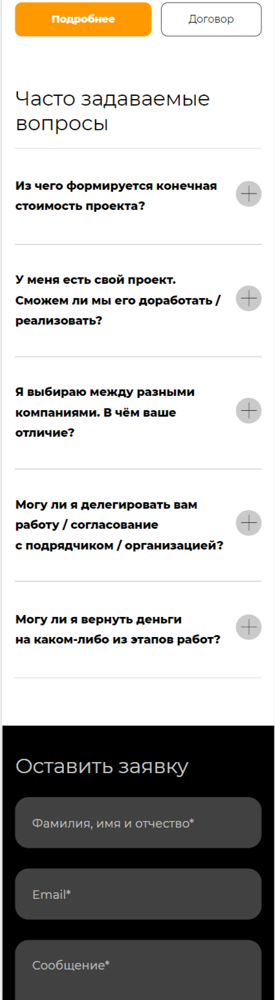

# Lionic

Адаптивная верстка сайта (1920, 1024, 768, 320px) строительной тематики без использования CSS-фреймворков [по макету Figma](https://www.figma.com/file/jxJoBD6yOPMKpCBkywMDVM/Cld-(Copy)?type=design&node-id=406480%3A4006&mode=dev).

## Скриншоты
### 1920px

### 1024px

### 768px

### 320px

